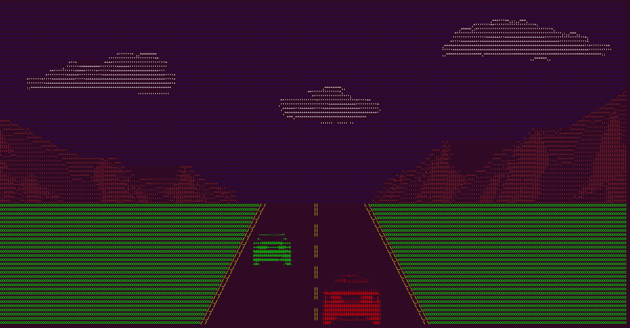
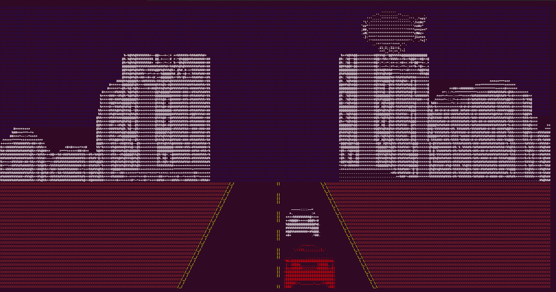
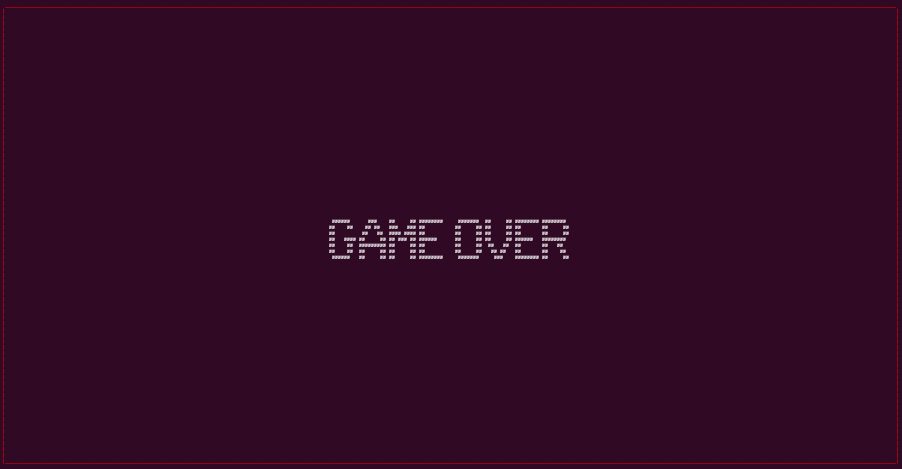
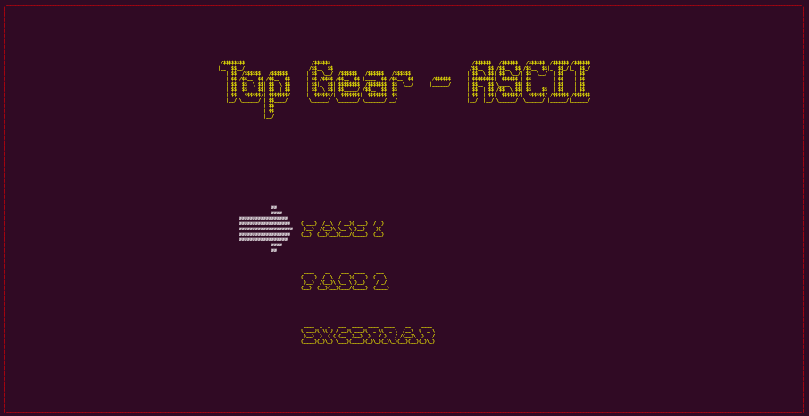
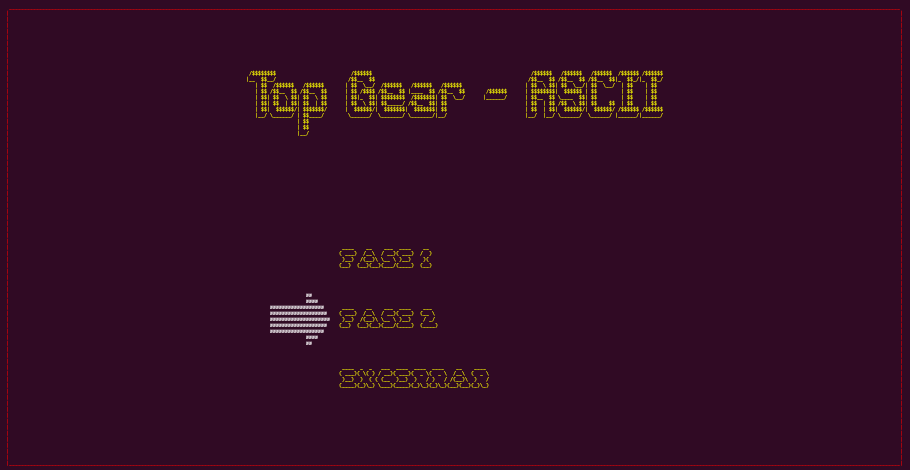
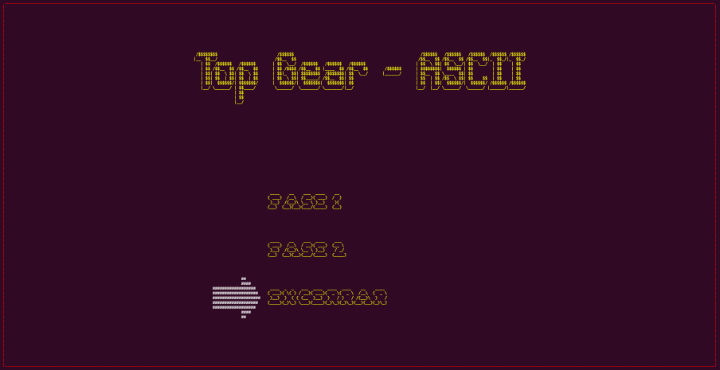

# TopGear - ASCII

**TopGear - ASCII** é uma recriação criativa do clássico jogo de corrida *Top Gear*, reinventado com gráficos em ASCII art. O jogo oferece uma experiência nostálgica em um formato retro, com uma jogabilidade fluida e desafios estratégicos enquanto você desvia de inimigos e cruza paisagens. Prepare-se para acelerar em um ambiente que mistura simplicidade com desafios de habilidade, tudo renderizado em pura arte de caracteres!

## 🎮 **Sobre o Jogo**

TopGear - ASCII é uma experiência de corrida baseada em ASCII, onde o jogador controla um herói e enfrenta diversos obstáculos, curvas e inimigos. O jogador pode escolher entre diferentes fases, com cenários distintos e mecânicas desafiadoras.

### **Características:**
- **Gráficos em ASCII:** Uma abordagem minimalista, utilizando caracteres para renderizar o jogo.
- **Fases Dinâmicas:** A cada fase, novos cenários, curvas e inimigos aparecem para desafiar o jogador.
- **Controle de Personagem:** Controle seu veículo/herói enquanto desvia de inimigos e evita colisões.
- **Músicas de Fundo:** Experimente a trilha sonora nostálgica de Top Gear, com música ambiente enquanto você corre.
- **Inimigos Inteligentes:** Três tipos de inimigos, cada um com comportamento diferente e mecânica de ativação.

## 🕹️ **Como Jogar**

- **Seta Esquerda**: Mova o herói para a esquerda.
- **Seta Direita**: Mova o herói para a direita.
- **Esc**: Pausa e encerra o jogo.

O objetivo é avançar pelas fases, desviando dos inimigos e ultrapassando obstáculos, enquanto o jogo progride em dificuldade. Conforme você avança, os inimigos vão sendo ativados em sequência, e o jogador deve permanecer alerta para evitar colisões.

## 🏎️ **Fases do Jogo**

### Fase 1:
- Cenário clássico de corrida com pista reta.
- Obstáculos e inimigos posicionados ao longo do caminho.


### Fase 2:
- Pistas com curvas à esquerda e à direita.
- Novos cenários, incluindo montanhas e prédios que simulam a sensação de movimento.


## ⚠️ **Game Over**

Quando o jogador perde, a tela de Game Over é exibida, encerrando a corrida e mostrando a mensagem de que o jogo terminou. A imagem abaixo representa a tela de Game Over:



O jogador pode então retornar ao menu principal e tentar novamente ou sair do jogo.


## 📋 **Menu do Jogo**

O menu do jogo apresenta opções para iniciar as fases ou sair do jogo. Aqui estão as imagens que representam o menu:

### Menu 1:


### Menu 2:


### Menu 3:


## 📋 **Requisitos**

Antes de começar, verifique se você possui as seguintes dependências instaladas:

- **SFML (Simple and Fast Multimedia Library)**: Biblioteca necessária para gráficos e manipulação de áudio. Você pode instalar a SFML seguindo as instruções disponíveis no [site oficial da SFML](https://www.sfml-dev.org/download.php).
  
- **AutoHotkey**: Um programa de automação que permite criar scripts simples para realizar tarefas repetitivas. Você pode baixá-lo no [site oficial do AutoHotkey](https://www.autohotkey.com/download/).

### Dependências do Projeto

- **g++**: Um compilador para C++ que você pode instalar através do [MinGW](https://sourceforge.net/projects/mingw/) ou de outra distribuição que inclua o `g++`.

Certifique-se de que todas essas dependências estão corretamente instaladas e configuradas antes de compilar e executar o jogo.


## 🛠️ **Instalação**

1. Clone este repositório:
   ```bash
   git clone https://github.com/seuusuario/TopGear-ASCII.git

2. Entre na pasta do projeto:
   ```bash
   cd TopGear-ASCII

3. Existem dois modos de compilação:
    ```bash
    Compile o projeto usando um compilador C++ que suporte o padrão C++11 ou superior:
    
    g++ -o game.exe src/ASCII_Engine/Core/*.cpp src/ASCII_Engine/utils/*.cpp src/ASCII_Engine/*.cpp src/Objetos/*.cpp src/Game/*.cpp src/Fases/*.cpp src/main.cpp -lsfml-audio

    ou
    
    Se estiver no windows e possuir um terminal ubuntu instalado compile o projeto usando um terminal PowerShell com o seguinte script:
        
        utils/makeplay.ps1

4. Se tiver compilado pela primeira opção, execute o arquivo:
    ```bash
    ./game.exe


## 📂 **Estrutura do Projeto**

- **main.cpp**: Ponto de entrada do jogo.
- **Game/**: Contém a lógica principal do jogo, incluindo a execução do menu e das fases.
- **Fases/**: Cada fase do jogo possui sua própria classe (Fase1, Fase2), com objetos e inimigos personalizados.
- **ASCII_Engine/**: Implementações de renderização de sprites, animações e controle de jogo em ASCII.

## 📖 **Descrição das Classes Principais**

### `Game`
Responsável por gerenciar o fluxo principal do jogo, alternando entre as diferentes fases (Fase1, Fase2) e o menu principal.

### `Fase`
Classe base que define a estrutura de uma fase do jogo. Contém a lista de objetos no cenário, incluindo o herói, pistas e inimigos.

### `Player`
Representa o jogador/veículo controlado. Possui métodos de movimento e colisão com os inimigos.

### `Enemy`
Inimigos controlados pelo jogo que o jogador deve evitar. Existem três tipos de inimigos, cada um com um tamanho e comportamento únicos.

## 🎵 **Trilha Sonora**

As músicas utilizadas no jogo são uma homenagem à trilha sonora icônica de *Top Gear*. A música de fundo é carregada durante a inicialização de cada fase, proporcionando uma imersão completa na atmosfera retro.

- "Top Gear: Las Vegas" (Fase 1)
- "Top Gear: Hiroshima" (Fase 2)

## 💡 **Funcionalidades Futuras**

- Fases adicionais com novos cenários e mecânicas.
- Sistema de pontuação baseado na distância percorrida sem colisões.
- Melhorias na IA dos inimigos para aumentar a dificuldade.
- Suporte para partidas multiplayer locais.

## 🤝 **Contribuições**

Sinta-se à vontade para contribuir com este projeto! Seguem algumas maneiras de contribuir:

- Relatar problemas (bugs).
- Melhorar a documentação.
- Implementar novas funcionalidades ou fases.

## 📄 **Licença**

Este projeto está licenciado sob a licença MIT - veja o arquivo [LICENSE](LICENSE) para mais detalhes.

## 🏆 **Créditos**

Desenvolvido com dedicação por Marcos Belo (https://github.com/marcovins), inspirado no clássico jogo *Top Gear*.

---

**Divirta-se correndo nas pistas ASCII!** 🏁
